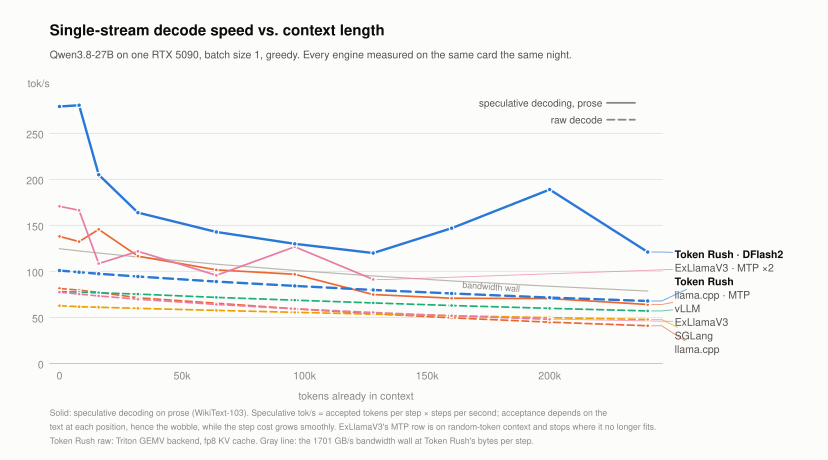
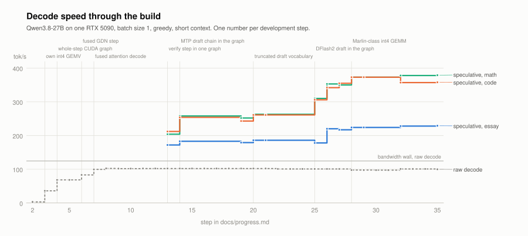
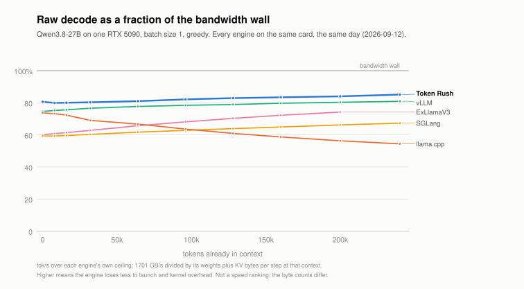

<div align="center">
  <picture>
    <source media="(prefers-color-scheme: dark)" srcset="docs/img/logo_dark.png">
    
  </picture>
  <h1>Token Rush</h1>
  <p><em>The fastest inference engine for Qwen3.8-27B on one RTX 5090 — built for one user, one card, one stream.</em></p>
</div>

## What you get

<picture>
  <source media="(prefers-color-scheme: dark)" srcset="docs/img/decode_vs_context_dark.svg">
  
</picture>

Every engine on the same card, the same day, the same prompts. Short context, greedy, tokens per second:

| engine, its fastest configuration | essay | code | math |
|---|---|---|---|
| **Token Rush** (DFlash2 draft, in-graph) | **229** | **358** | **379** |
| SGLang + DSpark | 106 | 138 | 207 |
| ExLlamaV3 + MTP ×2 | 132 | 142 | 166 |
| ollama (its default MTP chain) | 129 | 135 | 166 |
| llama.cpp + MTP | 124 | 115 | 160 |
| vLLM (raw; its speculative paths are slower) | 78 | 78 | 78 |

At 200k tokens of context it still decodes prose at 200–220 tok/s with speculation and 70 tok/s without, against 60 for the next best engine. The full 256k window fits and works: needle retrieval at 262k tokens, 26 GB of VRAM.

It is a server too. `python -m tokenrush.serve` speaks the OpenAI and Anthropic APIs, keeps the conversation resident so a turn costs only its new tokens, and Claude Code runs on it end to end.

## What you lose

- **One stream.** Batch size 1, one request at a time; a second client queues. Throughput under load was traded for latency, deliberately and everywhere: no scheduler, no paged KV, no batching in any kernel.
- **4.25 bits per weight.** The weights are int4 with a 128-group scale and minimum, calibrated with GPTQ. Against bf16: mean KL 0.023, top-1 agreement 94.2%, WikiText-2 perplexity 6.37 vs 6.26, GSM8K 97.0% vs 96.0%. The best 4-bit quantization we know of (ExLlamaV3) is at KL 0.013; ours is not there. Details, rivals and the recipe in [Quantization](#quantization).
- **One model, one card, text only.** Qwen3.8-27B's text path on an RTX 5090 (`sm_120`); the vision tower is dropped. Nothing is generic.

## Usage

An RTX 5090 with a CUDA 13 driver, and [`uv`](https://docs.astral.sh/uv/). The first command creates the environment (torch cu130, Triton, the GDN kernels) and the first run downloads the checkpoint (17 GB) and the DFlash2 draft (3.9 GB) into the Hub cache:

```bash
uv run python -m tokenrush.run --chat --prompt "Explain speculative decoding in three sentences."
```

Serve. OpenAI Chat / Completions and Anthropic Messages on one port; Claude Code needs two environment variables:

```bash
uv run python -m tokenrush.serve --port 8000
```

```bash
ANTHROPIC_BASE_URL=http://127.0.0.1:8000 ANTHROPIC_AUTH_TOKEN=anything claude
```

`--draft mtp` switches to the shipped MTP head as the draft (the default picks it for Chinese prompts), `--no-spec` / `--draft raw` turns speculation off, `--max-len` sets the context window (256k needs ~30 GB with both drafts). More in [docs/serving.md](docs/serving.md).

## How

<picture>
  <source media="(prefers-color-scheme: dark)" srcset="docs/img/progress_dark.svg">
  
</picture>

The engine is about 6,000 lines of PyTorch, Triton and one CUDA kernel, written for this one model and card. The steps that moved the number (every step, with what it measured, in [docs/progress.md](docs/progress.md)):

| step | what changed | tok/s |
|---|---|---|
| 2 | the model as plain functions over explicit state: contiguous KV, FP32 recurrent state, int4 weights dequantized on the fly | 3 |
| 3 | own int4 GEMV in Triton, projections fused | 36 |
| 4 | **the whole decode step in one CUDA graph**: 64 layers, lm_head, sampling, the token fed back on device | 68 |
| 6 | the 48 Gated DeltaNet layers each as one fused kernel (conv, gating, delta rule, norm, output gate) | 83 |
| 7 | fused flash-decoding attention over the live length, no context buckets | 100 |
| 8–9 | split-K GEMV with partials summed in the norm; FP8 KV cache and a prefill attention kernel, so 256k fits | 102 |
| 13–14 | **speculative decoding inside the graph**: the MTP head's draft chain, an M-row verify step, accept and commit on device | 183 / 254 / 258 |
| 20 | the draft reads a 128k-row slice of lm_head instead of all 248k | 186 / 261 / 263 |
| 25–27 | **DFlash2 as the draft**: 7 tokens per draft forward from a block-diffusion model, on our kernels, int4, ring cache | 217 / 355 / 350 |
| 28 | a Marlin-class int4 GEMM for the verify step: verifying 7 tokens costs 1.13× one raw step | 224 / 373 / 373 |

Three of them carry most of the result. The CUDA graph removed 9 ms of kernel-launch time from a 10 ms budget — the hybrid architecture's 48 recurrent layers are chains of small ops that no engine with dynamic batching can capture whole. Speculation is where the headline comes from: at batch size 1 the tensor cores are idle, so verifying seven draft tokens costs little more than decoding one, and general engines cannot afford that trade under batching. And every kernel was tuned against measured byte counts on this card, because nothing else feeds a Blackwell's bandwidth.

<picture>
  <source media="(prefers-color-scheme: dark)" srcset="docs/img/wall_fraction_dark.svg">
  
</picture>

Single-stream decode is bound by memory bandwidth: every step reads all the weights plus the KV cache once, so `tok/s ≈ 1701 GB/s ÷ bytes per step`, where 1701 is the measured read bandwidth of the card. At 4.25 bits the weights are 14.3 GB, a ceiling of 119 tok/s at empty context. The chart above is each engine's raw decode as a fraction of *its own* ceiling, so it measures the engine and not the quantization: what is left after launch overhead, synchronization and kernels that do not stream at full rate. We hold 80–85% and rise with context; llama.cpp falls to 54% at 240k because its attention path degrades with length, while the recurrent layers — 48 of the 64 — carry constant-size state and cost nothing extra.

Two things follow. Raw decode was close to solved before we started: vLLM sits at 75–81% and cuBLAS alone streams at 96%, so the raw margin is a few points of the wall plus reading fewer bytes. The only way *through* the wall is to emit more than one token per step, which is what the top half of the first chart shows.

## Quantization

Bits per weight is the second-largest lever after speculation: it sets the ceiling. The format is group-wise asymmetric int4, 128 weights per bf16 scale and minimum, 4.25 bits per weight on the 401 large matrices; embeddings, norms and the small projections stay bf16. The format was frozen on day 2 and never changed, so every kernel, graph and draft is independent of how the codes are chosen, and a better quantizer is a drop-in.

The codes are chosen by GPTQ — 256 calibration sequences of 2048 tokens (WikiText-103, torch's sources, GSM8K train), layers quantized sequentially, `lm_head` last on the quantized body's hidden states — plus an MSE range search per group that clips a few outliers to buy precision for the rest. About 200 lines, 20 minutes on one card.

Measured against bf16 logits over 81,920 positions of held-out text (WikiText-2 test, code, math), the same forward for every candidate:

| checkpoint | bits/weight | KL to bf16 | top-1 | WikiText-2 PPL (bf16 6.255) |
|---|---|---|---|---|
| llama.cpp UD-Q4_K_M | 4.80 | 0.0093 | 0.966 | 6.270 |
| ExLlamaV3 4.00 bpw | 4.10 | 0.0128 | 0.960 | 6.274 |
| **Token Rush, GPTQ + MSE** | **4.25** | **0.0232** | 0.942 | 6.365 |
| NVFP4 (QUASAR QAT) | 5.07 | 0.0231 | 0.943 | 6.369 |
| RedHatAI INT4 (AWQ + GPTQ) | 4.71 | 0.0458 | 0.924 | 6.460 |
| Token Rush, round-to-nearest | 4.25 | 0.0546 | 0.905 | 6.495 |

Calibration took KL from 0.055 to 0.023; the gap to ExLlamaV3 is the uniform 16-level grid itself, which its trellis code avoids at the cost of a different kernel. GSM8K through the engine: 194/200, against 192/200 for bf16.

The checkpoint is published at [`zyhector/Qwen3.8-27B-TokenRush-int4g128`](https://huggingface.co/zyhector/Qwen3.8-27B-TokenRush-int4g128) and is what the engine downloads. To rebuild it from the bf16 weights, or to measure another quantization on the same yardstick:

```bash
bash scripts/quantize/build.sh
```

The full thread — the yardstick, the rivals' formats, what each refinement was worth — is [docs/quantization.md](docs/quantization.md).

## Correctness

Two gates. The bf16 path matches HF transformers token for token on greedy decoding; every fused kernel is differential-tested against a torch reference; CUDA-graph replay matches eager execution; and speculative greedy output equals raw greedy output exactly, which is the one check that is truly exact. Long context is verified by needle retrieval at 131k and 262k. `pytest tests/` runs the 65 tests; the kernel tests need the card, the protocol and session tests do not.

## Numbers

Every number here comes from one machine in one sitting, 2026-09-12, every rival re-run from its own recipe the same day: the logs are in [results/2026-09-12-machine-59052/](results/2026-09-12-machine-59052/), the tables are generated from them by `scripts/sweep_table.py` and `scripts/matrix_table.py`, the figures by `scripts/plot_sweep.py` and `scripts/plot_progress.py`. The rivals' versions, flags and traps are in [docs/baselines.md](docs/baselines.md); the machine in [docs/environment.md](docs/environment.md); the step-by-step record in [docs/progress.md](docs/progress.md).

## Layout

| | |
|---|---|
| `tokenrush/` | the engine: `model.py` (the text path), `fused.py` / `ops.py` (Triton kernels), `csrc/` (the Marlin port), `spec.py` / `mtp.py` / `dflash.py` (speculation), `gptq.py` / `quant.py` (quantization), `run.py`, `serve.py` |
| `bench/` | the measurements: decode, context sweeps, quality, needle, GSM8K |
| `scripts/` | rival benches, the quantization recipe, table and figure generators |
| `tests/` | the differential and protocol tests |
| `docs/` | baselines, environment, progress, quantization, serving, traps |
| `results/` | raw logs of every reported run |

## Author

I am an MS in Computer Science student at USC, graduating in June 2027, and I am looking for AI infrastructure roles — inference engines, kernels, serving systems — in the Bay Area, Seattle or Los Angeles. If this is the kind of work your team does, or you know a team it would fit, I would be glad to hear from you on [LinkedIn](https://www.linkedin.com/in/hectorzhu/).
